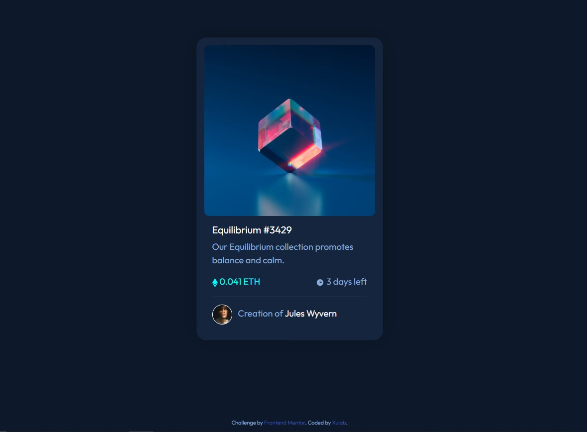

# Frontend Mentor - NFT preview card component solution

This is a solution to the [NFT preview card component challenge on Frontend Mentor](https://www.frontendmentor.io/challenges/nft-preview-card-component-SbdUL_w0U). Frontend Mentor challenges help you improve your coding skills by building realistic projects. 

## Table of contents

- [Overview](#overview)
  - [The challenge](#the-challenge)
  - [Screenshot](#screenshot)
- [Links](#links)
- [Built with](#built-with)
- [Continued development](#continued-development)
- [Author](#author)
- [Acknowledgments](#acknowledgments)


### The challenge

Users should be able to:

- View the optimal layout depending on their device's screen size
- See hover states for interactive elements

### Screenshot



### Links

- Live Site URL: [Add live site URL here](https://your-live-site-url.com)

### Built with

- Semantic HTML5 markup
- CSS custom properties
- Bootstrap v5.0

To see how you can add code snippets, see below:

```html
<div class="card" >
   <a class="img-a"> </a>
    <div class="card-body">
      <h5 class="card-title"><a href="#">Equilibrium #3429</a> </h5>
      <p class="card-text">Our Equilibrium collection promotes balance and calm.</p>
      <div class="d-flex justify-content-between">
        <span class="time"> 0.041 ETH</span><span>  3 days left</span>
      </div>
      <hr>
      <div class="creator">
       
      <p class="d-inline ms-2">Creation of <span class="creator-name"> <a href="#">Jules Wyvern</a> </span></p> 
      </div>
    </div>
  </div>
</main>
  <div class="attribution">
    Challenge by <a href="https://www.frontendmentor.io?ref=challenge" target="_blank">Frontend Mentor</a>. 
    Coded by <a href="#">Xulab</a>.
  </div>
```

### Continued development

Bootstrap is one of the framework I am wanting to become well verse in. It helps development pages really quickly. I totally recommend it if you have a deadline with your project.

## Author

- Website - [Xulab](https://substeven.netlify.app/)
- Frontend Mentor - [@Xulab05](https://www.frontendmentor.io/profile/Xulab5)
- Twitter - [@Xulab05](https://www.instagram.com/xulab05/)

## Acknowledgments
I'd like to give thanks to Front-end for this awesome short project.
